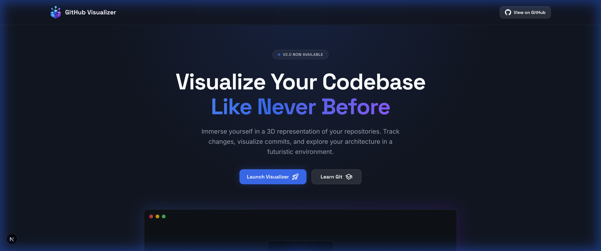
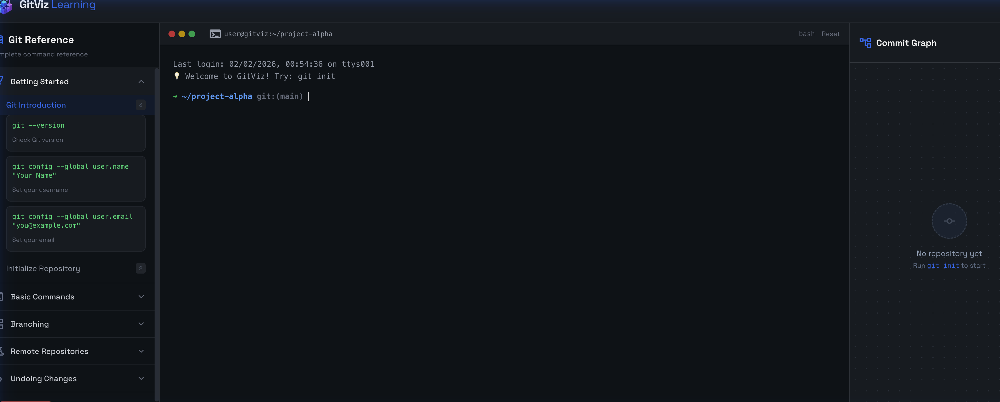

# GitHub Visualizer

**See your code. Understand your structure.**

A visual developer tool that transforms GitHub repositories into interactive 2.5D treemaps and teaches Git through a hands-on terminal simulator.



[**🌐 Live Demo**](https://github-visualizer-olive.vercel.app/) &nbsp;&nbsp; [](https://vercel.com/new/clone?repository-url=https%3A%2F%2Fgithub.com%2FVeerpratapsingh08%2FGithub-Visualizer&root-directory=github-visualizer)

---

## What This Does

### 🗺️ Repository Visualization
Paste any public GitHub URL and watch it transform into a treemap where:
- **Block height** = file size
- **Block color** = file type (TypeScript is blue, CSS is purple, etc.)
- **Nested rectangles** = folder hierarchy

Hover over any block to see file details. Drag to orbit. Scroll to zoom.

### 🎓 Interactive Git Learning
A built-in terminal simulator where you can practice Git commands and see the commit graph update in real-time. No risk of breaking anything—it's all simulated.

---

## Screenshots

| Repository Treemap | Git Learning Terminal |
|-------------------|----------------------|
|  |  |


---

## Philosophy

This project believes in:

- **Visual understanding over raw metrics** — A picture of your codebase tells you more than LOC counts
- **Minimal UI, maximum clarity** — Hide controls until needed, let the visualization speak
- **Learning by interaction** — Type commands, see results, build intuition
- **Exploration over instruction** — No tutorials, just tools to discover

---

## Tech Stack

| Layer | Technology |
|-------|------------|
| Framework | Next.js 16 (App Router) |
| 3D Rendering | Three.js + React Three Fiber |
| Styling | Tailwind CSS |
| Language | TypeScript |
| API | GitHub REST API (unauthenticated) |

---

## Local Setup

```bash
# Clone the repository
git clone https://github.com/Veerpratapsingh08/Github-Visualizer.git
cd Github-Visualizer/github-visualizer

# Install dependencies
npm install

# Start development server
npm run dev
```

Open [http://localhost:3000](http://localhost:3000) in your browser.

### Requirements
- Node.js 18+
- npm 9+

---

## Non-Goals

Things this project intentionally does not do:

- **No authentication** — We use GitHub's public API only
- **No private repos** — By design, to keep it simple
- **No backend** — Everything runs client-side
- **No analytics/tracking** — Your data stays in your browser
- **No historical analysis** — We show current state, not trends

---

## Known Limitations

- **Rate limiting**: GitHub's unauthenticated API allows ~60 requests/hour. Large repos may hit this.
- **Large repos**: Repositories with 10,000+ files may be slow to render.
- **Mobile**: The 3D view isn't optimized for touch devices yet.

---

## Roadmap

### Now
- [x] Treemap visualization
- [x] File type color coding
- [x] Interactive Git terminal
- [x] Commit graph visualization

### Next
- [ ] GitHub OAuth for higher rate limits
- [ ] Search/filter files in visualization
- [ ] Export visualization as image
- [ ] Keyboard navigation

### Later
- [ ] Compare two branches visually
- [ ] Private repository support
- [ ] VS Code extension

---

## Contributing

We welcome contributions! See [CONTRIBUTING.md](./CONTRIBUTING.md) for guidelines.

**Good first issues** are labeled `good-first-issue` — these are ideal for newcomers.

### Quick Contribution Ideas
- Add support for a new file type color
- Improve mobile responsiveness
- Add a new Git command to the simulator
- Fix a typo in the UI

---

## License

MIT License — see [LICENSE](./LICENSE) for details.

---

## Author

**Veer Pratap Singh**  
[Portfolio](https://veerpratapsingh.vercel.app) · [GitHub](https://github.com/Veerpratapsingh08)

---

<p align="center">
  Made with ❤️ for developers who think visually
</p>
